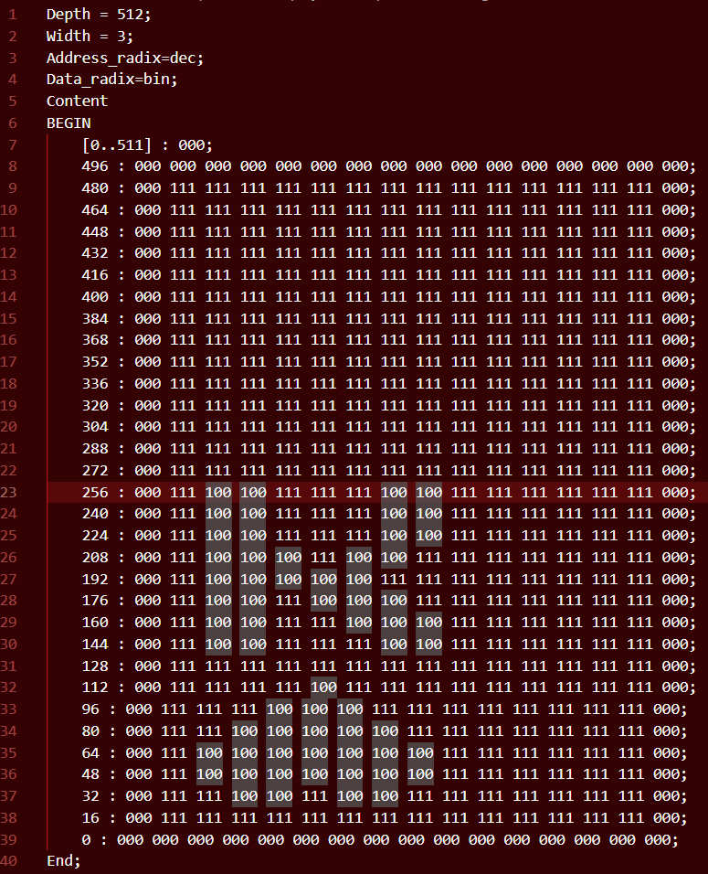
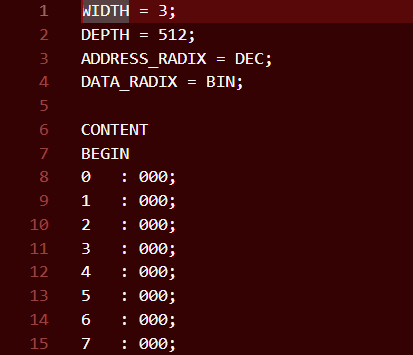

# MIF Serializer
## What is this?
I wrote this Python program for my ECE241 final project. It efficiently reformats memory initialization files (or MIFs) created using the instructor-provided [bmp2mif](https://www.eecg.utoronto.ca/~jayar/ece241_08F/vga/vga-bmp2mif.html) converter.

I needed this code to reformat MIFs for a deck of cards; the code I wrote didn't accept the MIFs in the formatting the converter produces. This is what the converter produces (example here is the king of hearts):


And this is what the serializer produces (which works with my Verilog):


## How can I use this?
1. Download this Python file (or just copy the code) and create a new Python project in your IDE of choice.
2. Copy your input MIFs into the project directory.
3. For every file you want to convert add a new ```parse_mif_to_new_format()``` call in ```mif_converter.py```.
4. Run ```python mif_converter.py``` in Terminal/Command Prompt.

I've included sample input and output MIFs if you don't have a bmp2mif converter on hand.

## Miscellaneous Notes
I slapped an MIT license onto this thing so if it doesn't work it's on you LOL.

I think I want to take this further and write a program to replace the bmp2mif converter (especially if I end up needing it for my own little projects). I'll probably add further functionality to allow the user to choose address and data radices. 