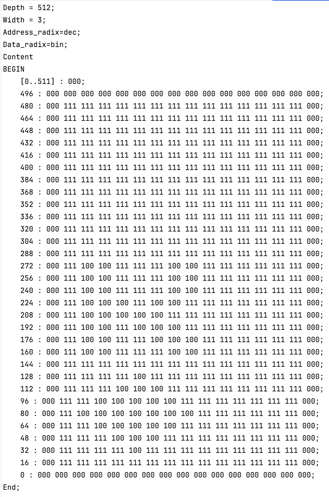
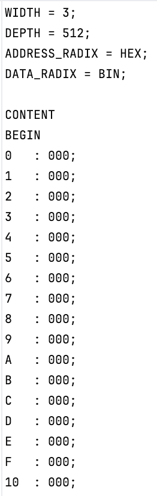

# MIF Serializer
## What is this?
I wrote this Python program for my ECE241 final project. It reformats memory initialization files (or MIFs) created using the instructor-provided [bmp2mif](https://www.eecg.utoronto.ca/~jayar/ece241_08F/vga/vga-bmp2mif.html) converter.

I needed this code to serialize MIFs for a deck of cards; the SDRAM[^1] IP core[^2] for the DE1-SoC does not accept vectorized MIFs, because it needs to read only one address per clock cycle, input must be provided serially (one at a time). This is what the instructor-provided converter produces (example here is the king of hearts):



And this is what the serializer produces (which works with my Verilog code):



## How can I use this?
1. Download this Python file (or just copy the code) and create a new Python project in your IDE of choice.
2. Copy your input MIFs into the project directory.
3. For every file you want to convert add a new ```serialize_mif()``` call in ```mif_converter.py```.
4. Run ```python mif_converter.py``` in Terminal/Command Prompt.

I've included sample input and output MIFs if you don't have a bmp2mif converter on hand. (I'm working on a Python version of the bmp2mif converter as well!)

## Any more updates to come?
Editing the code every time you want to convert a new file is tedious, so I'm working to add new functionality so that the user can provide input and output file names during runtime. The idea is that one should only need to pull the source code and can begin converting their files, no edits need be made to the file. 

[^1]: Synchronous Dynamic Random Access Memory (lots of big words but essentially means clocked memory)
[^2]: Intellectual Property Core (third-party, licensed code for FPGAs/ASICs that does a specific job, in this case, build a memory module)
